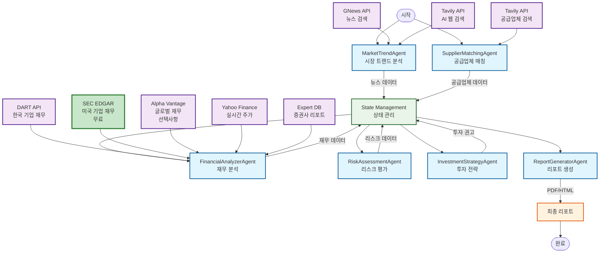

# EVI Agent System - 시스템 아키텍처

## 전체 시스템 구조



## 데이터 흐름 상세

### 1. MarketTrendAgent (시장 트렌드 분석)

```
입력:
- 전기차 관련 키워드
- 검색 기간 설정

처리:
1. GNews API로 전기차 뉴스 수집
2. Tavily API로 추가 웹 검색 (유료, 고품질)
3. DuckDuckGo Fallback (무료)
4. 키워드 추출 및 카테고리화
   - 기업 키워드 (Tesla, LG에너지솔루션)
   - 기술 키워드 (배터리, 충전)
   - 시장 키워드 (수요, 공급)
   - 투자 키워드 (성장, 전망)

출력:
- 뉴스 기사 리스트
- 카테고리별 키워드
- 발견된 기업 리스트
```

### 2. SupplierMatchingAgent (공급업체 매칭)

```
입력:
- MarketTrendAgent에서 추출한 키워드
- 발견된 기업 리스트

처리:
1. 내장 공급업체 데이터베이스 매칭
2. Tavily API로 웹 검색
3. 공급 관계 분석
   - 공급 (직접 부품 공급)
   - 협력 (기술 협력)
   - 경쟁 (경쟁사)
   - 불명확 (관계 불명)
4. 신뢰도 점수 계산

출력:
- 검증된 공급업체 리스트
- OEM 관계 매핑
- 신뢰도 점수
```

### 3. FinancialAnalyzerAgent (재무 분석)

```
입력:
- 공급업체 리스트
- 시장 트렌드 데이터

처리:
【한국 기업】
1. DART API로 기업 조회
2. DART API로 재무제표 수집
   - 손익계산서 (매출, 영업이익, 순이익)
   - 재무상태표 (자산, 부채, 자본)
   - 현금흐름표
3. Yahoo Finance로 실시간 주가 수집
4. 재무비율 계산
   - ROE, 영업이익률, ROA (수익성)
   - 부채비율, 유동비율 (안정성)

【미국 기업】
1. SEC EDGAR API로 재무제표 수집 ⭐ 무료
   - 10-K (연간 보고서)
   - 10-Q (분기 보고서)
   - 공식 SEC 제출 서류 (신뢰도 최고)
2. Alpha Vantage API (SEC 실패 시)
3. Yahoo Finance로 주가 수집

【비미국 해외 기업】
1. Alpha Vantage API (설정 시)
2. Yahoo Finance로 주가 수집

【정성적 분석 (70%)】
1. 증권사 리포트 데이터베이스 조회
2. 웹 검색으로 애널리스트 의견 수집
3. 시간 가중치 적용 (최신 리포트 우선)
4. 분석가 센티먼트 × 0.6
5. 시장 트렌드 영향 × 0.25
6. 공급업체 관계 × 0.15

【정량적 분석 (30%)】
- ROE × 25%
- 영업이익률 × 25%
- ROA × 20%
- 부채비율 × 15%
- 유동비율 × 15%

출력:
- 기업별 재무 데이터
- 정성적 점수 (70%)
- 정량적 점수 (30%)
- 최종 투자 점수
```

### 4. RiskAssessmentAgent (리스크 평가)

```
입력:
- 재무 분석 결과
- 시장 트렌드

처리:
【정량적 리스크 (80%)】
1. 재무 리스크
   - 부채비율 > 50%
   - 유동비율 < 1.0
   - ROE < 10%
   - 영업이익률 < 5%
2. 시장 리스크
   - Beta > 1.2 (고변동성)
   - 변동성 > 30%
   - 시가총액 < 1000억원

【정성적 리스크 (20%)】
1. 지배구조 리스크
   - 경영진 안정성
   - 이사회 구성
   - 감사 품질
2. 법적 리스크
   - 소송 위험
   - 규제 준수

출력:
- 기업별 리스크 등급
- 고위험/저위험 기업 분류
- 리스크 요인 상세
```

### 5. InvestmentStrategyAgent (투자 전략)

```
입력:
- 재무 분석 결과
- 리스크 평가 결과

처리:
1. 투자 기회 식별
   - 재무 점수 + 리스크 점수 통합
   - 매력도 점수 계산
2. 포트폴리오 구성
   - 고위험 기업 제외
   - 분산 투자 전략
3. 투자 등급 결정
   - Strong Buy (0.8+)
   - Buy (0.6-0.8)
   - Hold (0.4-0.6)
   - Sell (0.4 미만)

출력:
- 추천 종목 리스트
- 포트폴리오 배분
- 투자 전략 요약
```

### 6. ReportGeneratorAgent (리포트 생성)

```
입력:
- 모든 에이전트의 분석 결과

처리:
1. 요약 보고서 생성
   - Executive Summary
   - Market Trends
   - Supply Chain Analysis
   - Financial Performance
   - Risk Assessment
   - Investment Strategy
2. Glossary 추가
3. 출처 및 참고자료

출력:
- JSON 파일
- Markdown 파일
- HTML 파일
- PDF 파일 (선택)
```

## API 우선순위

### 뉴스 수집
```
1순위: Tavily API (유료, 고품질)
2순위: GNews API (무료, 제한적)
3순위: DuckDuckGo (무료, Fallback)
```

### 한국 기업 재무
```
1순위: DART API (공식 공시)
2순위: Yahoo Finance (실시간 주가)
```

### 미국 기업 재무
```
1순위: SEC EDGAR (무료, 공식 10-K/10-Q)
2순위: Alpha Vantage (유료, 선택)
3순위: Yahoo Finance (주가만)
```

### 비미국 해외 기업
```
1순위: Alpha Vantage (설정 시)
2순위: Yahoo Finance (주가만)
```

## 데이터 신뢰도

| 데이터 소스 | 신뢰도 | 비용 | 커버리지 |
|-----------|--------|------|---------|
| **SEC EDGAR** | ⭐⭐⭐⭐⭐ | 무료 | 미국 상장 기업 |
| **DART API** | ⭐⭐⭐⭐⭐ | 무료 | 한국 상장 기업 |
| **Tavily API** | ⭐⭐⭐⭐ | 유료 | 글로벌 웹 |
| **Alpha Vantage** | ⭐⭐⭐⭐ | 무료/유료 | 글로벌 기업 |
| **Yahoo Finance** | ⭐⭐⭐ | 무료 | 글로벌 주가 |
| **GNews API** | ⭐⭐⭐ | 무료 | 글로벌 뉴스 |
| **Expert DB** | ⭐⭐⭐⭐ | 내장 | 증권사 리포트 |

## 성능 최적화

### API 요청 제한
```
- SEC EDGAR: 10 requests/10 seconds
- DART API: 제한 없음
- Tavily API: 유료 플랜에 따라 다름
- Alpha Vantage: 5 requests/minute (무료)
- Yahoo Finance: 2000 requests/hour
```

### 캐시 전략
```
- 뉴스: 1시간 캐시
- 재무 데이터: 24시간 캐시
- 주가: 5분 캐시
- 증권사 리포트: 7일 캐시
```

## 에러 처리

### Fallback 순서
```
뉴스: Tavily → GNews → DuckDuckGo → 내장 데이터
재무: SEC/DART → Alpha Vantage → Yahoo → 제외
웹 검색: Tavily → DuckDuckGo → 내장 데이터
```

### 에러 로깅
```
- API 실패: 경고 로그 + Fallback
- 데이터 없음: 정보 로그 + 분석 제외
- 시스템 오류: 에러 로그 + 중단
```

---

**마지막 업데이트**: 2025-10-23
**버전**: 2.0 (SEC EDGAR 추가)
