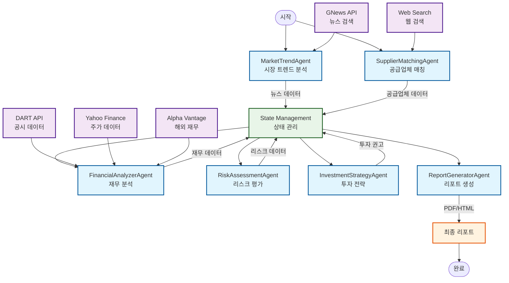
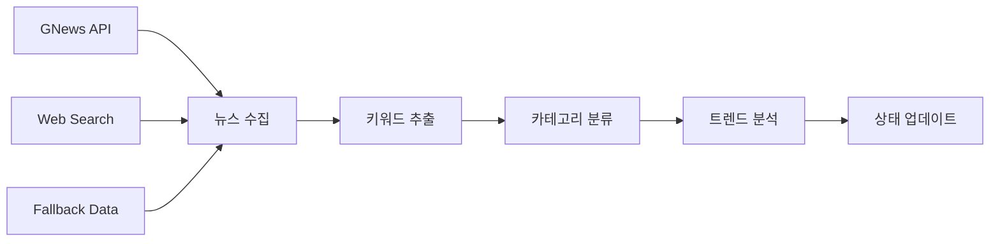
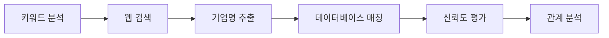
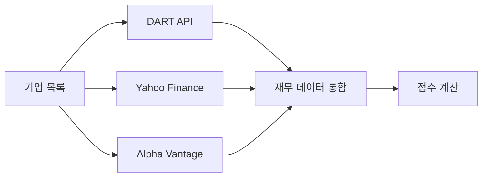
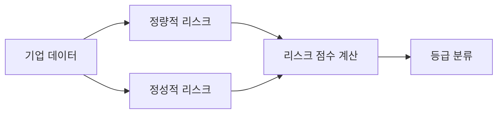
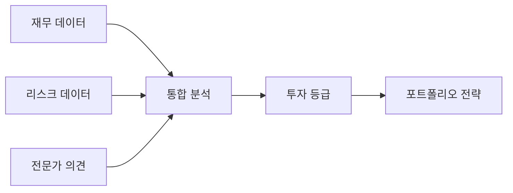
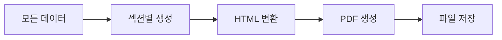
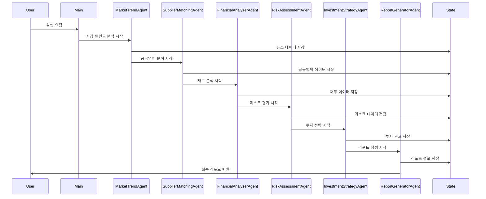
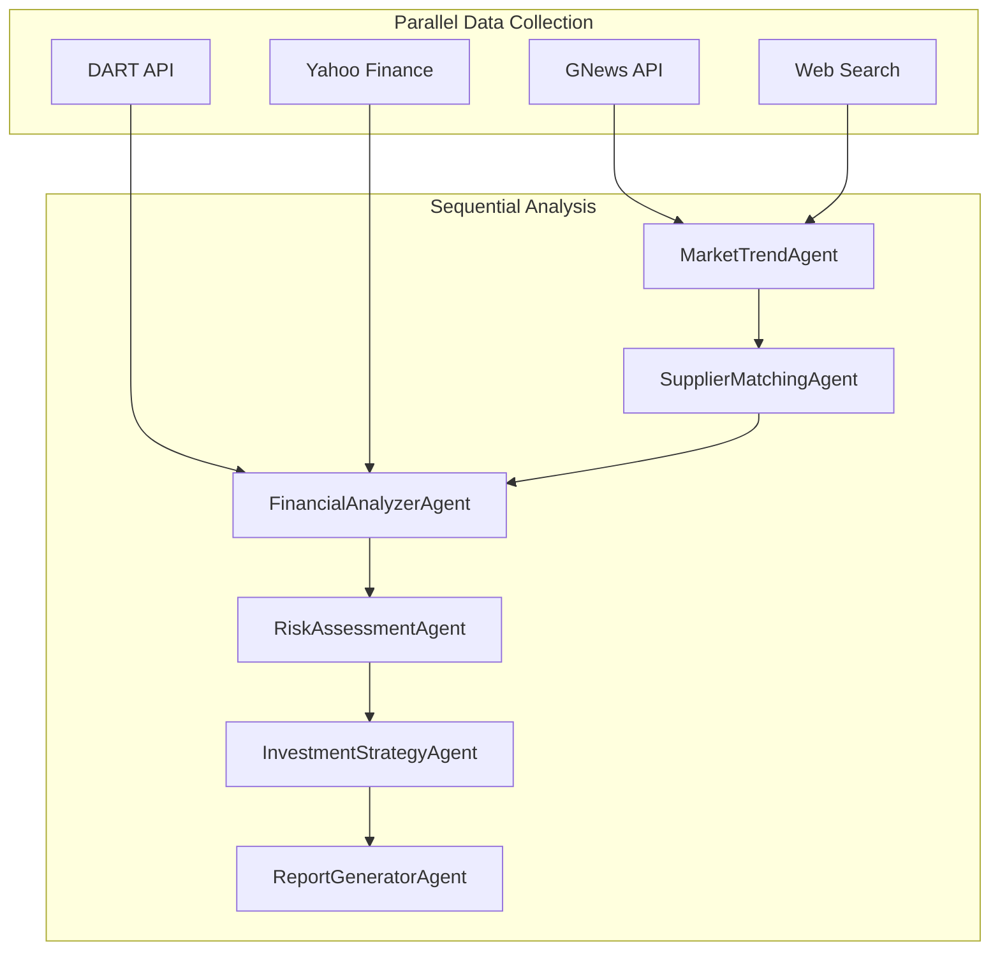
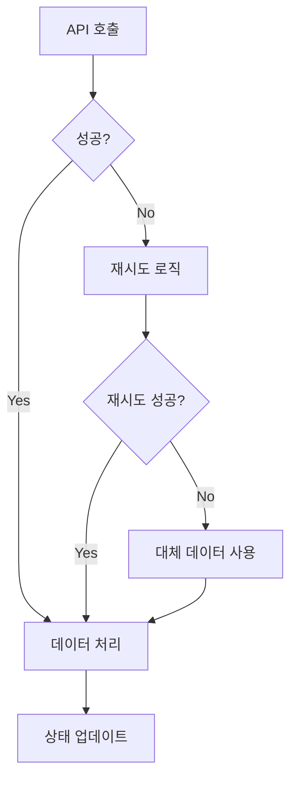

# 🏗️ EVI_Agent Architecture Design

## 📋 Overview

본 문서는 **Electric Vehicle Intelligence Multi-Agent System (EVI_Agent)**의 아키텍처 설계를 상세히 설명합니다. LangGraph 기반 멀티 에이전트 시스템으로 전기차 산업 분석을 자동화합니다.

---

## 🎯 System Architecture

### **Graph Diagram**



---

## 🔄 State Definition

### **Core State Schema**

| Key | Type | Description | Example |
|-----|------|-------------|---------|
| `news_articles` | List[Dict] | 수집된 뉴스 기사 | `[{"title": "...", "content": "...", "source": "GNews"}]` |
| `categorized_keywords` | Dict[str, List[str]] | 카테고리별 키워드 | `{"companies": ["Tesla", "BYD"], "tech": ["battery", "charging"]}` |
| `suppliers` | List[Dict] | 공급업체 정보 | `[{"name": "LG에너지솔루션", "category": "배터리", "confidence": 0.9}]` |
| `financial_data` | Dict[str, Dict] | 기업별 재무 데이터 | `{"Tesla": {"revenue": 1000, "profit": 200}}` |
| `risk_assessment` | Dict[str, Any] | 리스크 평가 결과 | `{"high_risk": 0, "low_risk": 3, "risk_factors": [...]}` |
| `investment_recommendations` | List[Dict] | 투자 권고사항 | `[{"company": "Tesla", "grade": "A", "confidence": 0.85}]` |
| `report_metadata` | Dict[str, Any] | 리포트 메타데이터 | `{"generated_at": "2024-01-01", "total_companies": 10}` |

### **Detailed State Structure**

```python
class EVIState(TypedDict):
    # 1. Market Trend Data
    news_articles: List[Dict[str, Any]]
    categorized_keywords: Dict[str, List[str]]
    market_trends: List[Dict[str, Any]]
    
    # 2. Supply Chain Data
    suppliers: List[Dict[str, Any]]
    supplier_relationships: Dict[str, List[str]]
    discovery_summary: Dict[str, int]
    
    # 3. Financial Data
    financial_data: Dict[str, Dict[str, Any]]
    financial_scores: Dict[str, float]
    market_data: Dict[str, Any]
    
    # 4. Risk Assessment
    risk_assessment: Dict[str, Any]
    risk_factors: List[Dict[str, Any]]
    risk_scores: Dict[str, float]
    
    # 5. Investment Strategy
    investment_recommendations: List[Dict[str, Any]]
    portfolio_strategy: Dict[str, Any]
    investment_grade: Dict[str, str]
    
    # 6. Report Generation
    report_sections: Dict[str, str]
    report_paths: Dict[str, str]
    glossary: Dict[str, str]
    
    # 7. Metadata
    analysis_metadata: Dict[str, Any]
    error_logs: List[str]
    processing_status: str
```

---

## 🔧 Agent Architecture

### **1. MarketTrendAgent**



**Responsibilities:**
- GNews API를 통한 실시간 뉴스 수집
- 키워드 추출 및 카테고리 분류
- 시장 트렌드 분석 및 패턴 인식

**Input:** None (자동 실행)
**Output:** `news_articles`, `categorized_keywords`, `market_trends`

### **2. SupplierMatchingAgent**



**Responsibilities:**
- 키워드 기반 공급업체 발굴
- DART 상장사 검증
- OEM-공급업체 관계 분석

**Input:** `categorized_keywords`
**Output:** `suppliers`, `supplier_relationships`, `discovery_summary`

### **3. FinancialAnalyzerAgent**



**Responsibilities:**
- 다중 API를 통한 재무 데이터 수집
- 정량적 분석 및 점수 계산
- 이벤트 스터디 기반 수익률 분석

**Input:** `suppliers`, `news_articles`
**Output:** `financial_data`, `financial_scores`, `market_data`

### **4. RiskAssessmentAgent**



**Responsibilities:**
- 정량적/정성적 리스크 평가
- 시간 가중치 적용
- 리스크 등급 분류

**Input:** `financial_data`, `suppliers`
**Output:** `risk_assessment`, `risk_factors`, `risk_scores`

### **5. InvestmentStrategyAgent**



**Responsibilities:**
- 정량/정성 데이터 통합 분석
- 투자 등급 및 권고사항 생성
- 포트폴리오 전략 수립

**Input:** `financial_data`, `risk_assessment`, `suppliers`
**Output:** `investment_recommendations`, `portfolio_strategy`, `investment_grade`

### **6. ReportGeneratorAgent**



**Responsibilities:**
- 종합 리포트 생성
- HTML/PDF 변환
- 용어 사전 및 참고자료 포함

**Input:** 모든 상태 데이터
**Output:** `report_sections`, `report_paths`, `glossary`

---

## 🔄 Data Flow Architecture

### **Sequential Processing Flow**



### **Parallel Processing Capabilities**



---

## 🛠️ Technical Architecture

### **Technology Stack**

| Layer | Technology | Purpose |
|-------|------------|---------|
| **Framework** | LangGraph | 멀티 에이전트 오케스트레이션 |
| **LLM** | OpenAI GPT-4o | 자연어 처리 및 분석 |
| **Data Sources** | GNews API, DART API, Yahoo Finance | 실시간 데이터 수집 |
| **Storage** | In-Memory State | 상태 관리 |
| **Output** | ReportLab, HTML | 리포트 생성 |
| **Caching** | Custom Cache Manager | API 호출 최적화 |

### **Error Handling Architecture**



### **Caching Strategy**

```python
class CacheManager:
    def __init__(self):
        self.cache = {}
        self.ttl = 3600  # 1시간
    
    def get_cached_result(self, key: str) -> Optional[Any]:
        # 캐시에서 결과 조회
    
    def set_cached_result(self, key: str, data: Any):
        # 캐시에 결과 저장
```

---

## 📊 Performance Metrics

### **Processing Time Estimates**

| Agent | Estimated Time | API Calls |
|-------|----------------|-----------|
| MarketTrendAgent | 30-60초 | 5-10개 |
| SupplierMatchingAgent | 20-40초 | 3-6개 |
| FinancialAnalyzerAgent | 15-30초 | 2-4개 |
| RiskAssessmentAgent | 10-20초 | 1-2개 |
| InvestmentStrategyAgent | 5-10초 | 0개 |
| ReportGeneratorAgent | 10-20초 | 0개 |
| **Total** | **90-180초** | **11-22개** |

### **Resource Usage**

- **Memory**: ~500MB (상태 데이터 + 캐시)
- **CPU**: 중간 (LLM 호출 시 높음)
- **Network**: 중간 (API 호출)
- **Storage**: ~50MB (리포트 파일)

---

## 🔒 Security & Reliability

### **API Key Management**
- 환경변수를 통한 API 키 관리
- .env 파일을 통한 로컬 설정
- API 키 노출 방지

### **Error Recovery**
- API 실패 시 대체 데이터 제공
- 재시도 로직 구현
- 명확한 에러 메시지 출력

### **Data Validation**
- 입력 데이터 유효성 검사
- API 응답 데이터 검증
- 타입 안전성 보장

---

## 📈 Scalability Considerations

### **Horizontal Scaling**
- 에이전트별 독립적 실행 가능
- 상태 공유를 통한 협업
- 병렬 처리 최적화

### **Vertical Scaling**
- 메모리 사용량 최적화
- 캐싱 전략 개선
- API 호출 최적화

### **Future Enhancements**
- 데이터베이스 연동
- 실시간 스트리밍
- 분산 처리 지원

---

*본 아키텍처 문서는 EVI_Agent 시스템의 설계 원칙과 구현 방식을 상세히 설명합니다. 시스템의 확장성과 유지보수성을 고려하여 설계되었습니다.*


