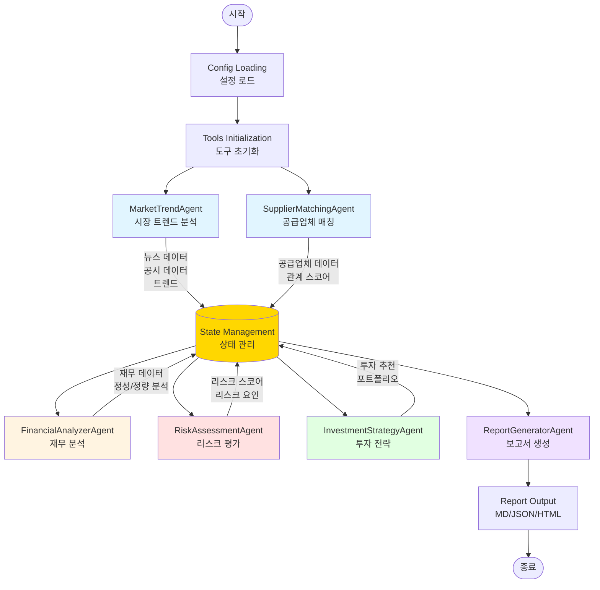
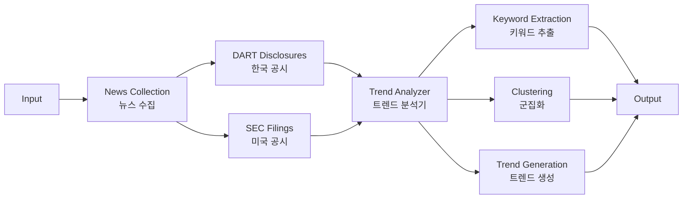
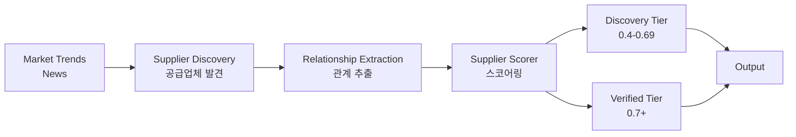
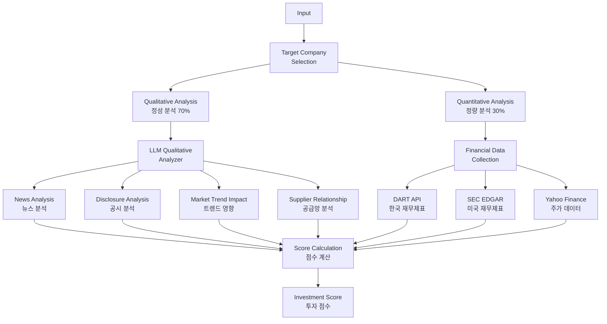
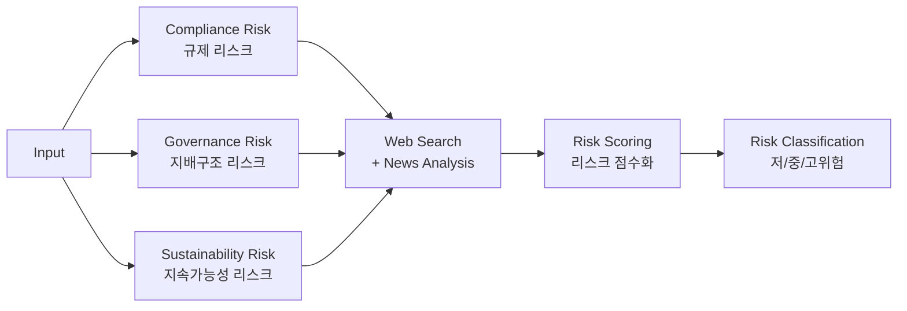
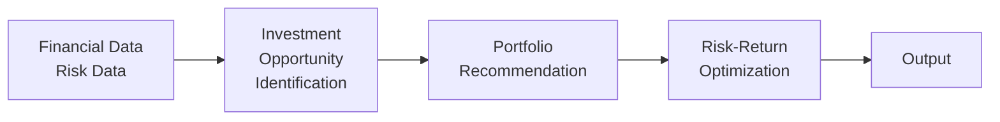
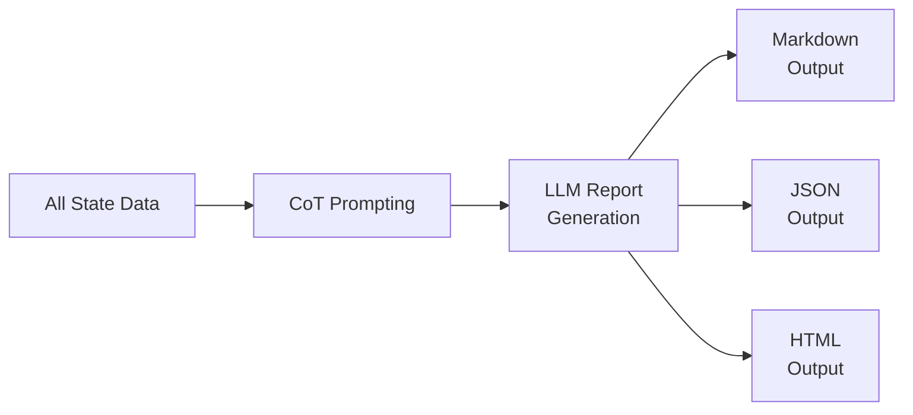
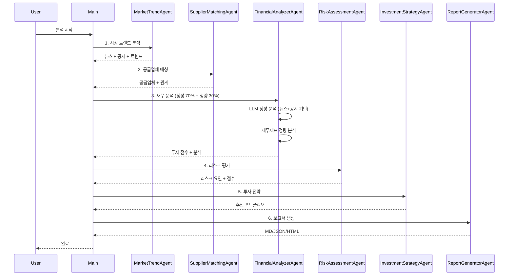

# EVI-AgentSystem Architecture (Updated 2025-10-25)

## 🏗️ System Overview



## 📦 Core Components

### **1. MarketTrendAgent** (시장 트렌드 분석)



**Tools Used**:
- ✅ `GNewsTool`: 뉴스 수집
- ✅ `DARTTagger`: 한국 공시 태깅
- ✅ `SECTagger`: 미국 공시 태깅
- ✅ `TrendAnalyzer`: 트렌드 분석 (불용어 제거, Fallback)

**Output**:
- `news_articles`: 뉴스 기사 리스트
- `disclosure_data`: 공시 데이터 리스트
- `categorized_keywords`: 분류된 키워드
- `market_trends`: 시장 트렌드 (최소 3개 보장)

---

### **2. SupplierMatchingAgent** (공급업체 매칭)



**Tools Used**:
- ✅ `SupplierScorer`: 신뢰도 스코어링 (2단계 버킷)
- ✅ Web Search: 공급업체 정보 검색

**Output**:
- `suppliers`: 공급업체 리스트 (discovery/verified 구분)
- `supplier_relationships`: OEM-Supplier 관계

---

### **3. FinancialAnalyzerAgent** (재무 분석)



**Tools Used**:
- ✅ `LLMQualitativeAnalyzer`: **실제 뉴스+공시 기반 LLM 정성 분석** (하드코딩 ❌)
- ✅ `DisclosureRouter`: 국가별 공시 API 라우팅
- ✅ `ScoringWithMissingData`: 결측값 처리 (섹터 중앙값 대체)
- ✅ DART/SEC/Yahoo Finance APIs

**Qualitative Analysis (70%)**:
```python
신뢰도 = min(100, 
    (뉴스 건수 × 5) + 
    (공시 건수 × 10) + 
    (공급망 관계 × 5)
)
```

**Analysis Output**:
- `overall_rating` (1-10): 투자 매력도
- `key_strengths`: 핵심 강점
- `key_risks`: 주요 리스크
- `growth_drivers`: 성장 동력
- `sentiment_score` (-1~1): 시장 심리
- `recommendation`: Buy/Hold/Sell

---

### **4. RiskAssessmentAgent** (리스크 평가)



**Tools Used**:
- ✅ Web Search: 리스크 정보 검색
- ✅ LLM: 리스크 분석 및 평가
- ⚠️ JSON Parser: JSON 파싱 (개선 필요)

**Output**:
- `risk_factors`: 리스크 요인 리스트
- `risk_scores`: 기업별 리스크 점수
- `high_risk_companies`: 고위험 기업
- `low_risk_companies`: 저위험 기업

---

### **5. InvestmentStrategyAgent** (투자 전략)



**Tools Used**:
- ✅ `ScoringWithMissingData`: Top-N 랭킹 (결측값 처리)
- ✅ Portfolio Optimization

**Output**:
- `investment_opportunities`: 투자 기회
- `recommended_portfolio`: 추천 포트폴리오
- `investment_horizon`: 투자 기간
- `target_audience`: 타겟 투자자

---

### **6. ReportGeneratorAgent** (보고서 생성)



**Output**:
- `report_20251025_HHMMSS.md`
- `report_20251025_HHMMSS.json`
- `report_20251025_HHMMSS.html`

---

## 🔄 Data Flow



---

## 🛠️ Tool Ecosystem

### **Data Collection Tools**

| Tool | Purpose | Data Source | Reliability |
|------|---------|-------------|-------------|
| `GNewsTool` | 뉴스 수집 | Tavily AI | 60-70% |
| `DARTTagger` | 한국 공시 | 금융감독원 | 90% |
| `SECTagger` | 미국 공시 | SEC EDGAR | 95% |
| `SECEdgarTool` | 미국 재무제표 | SEC API | 95% |
| `YahooFinanceTool` | 주가 데이터 | Yahoo Finance | 75-80% |

### **Analysis Tools**

| Tool | Purpose | Method |
|------|---------|--------|
| `TrendAnalyzer` | 트렌드 분석 | 불용어 제거 + 군집화 + Fallback |
| `SupplierScorer` | 공급업체 스코어링 | 2단계 버킷 (발견/검증) |
| `LLMQualitativeAnalyzer` | **정성 분석** | **실제 뉴스+공시 기반 LLM** |
| `DisclosureRouter` | 공시 라우팅 | 국가별 API 선택 |
| `ScoringWithMissingData` | 결측값 처리 | 섹터 중앙값 대체 |

### **Output Tools**

| Tool | Purpose | Format |
|------|---------|--------|
| `ReportGenerator` | 보고서 생성 | Markdown, JSON, HTML |

---

## 📊 State Management

```python
state = {
    # Market Trend Agent
    'news_articles': List[Dict],
    'disclosure_data': List[Dict],
    'categorized_keywords': Dict[str, List[str]],
    'market_trends': List[Dict],
    
    # Supplier Matching Agent
    'suppliers': List[Dict],
    'supplier_relationships': List[Dict],
    
    # Financial Analyzer Agent
    'target_companies': List[str],
    'financial_analysis': Dict[str, Dict],
    'investment_scores': Dict[str, float],
    
    # Risk Assessment Agent
    'risk_factors': List[Dict],
    'risk_scores': Dict[str, float],
    'high_risk_companies': List[str],
    'low_risk_companies': List[str],
    
    # Investment Strategy Agent
    'investment_opportunities': List[Dict],
    'recommended_portfolio': Dict,
    
    # Metadata
    'errors': List[Dict],
    'citations': List[Citation]
}
```

---

## 🎯 Key Improvements (2025-10-25)

### ✅ **Completed**

1. **정성적 분석 시스템 재구축**
   - ❌ 제거: 하드코딩된 가짜 전문가 의견
   - ✅ 추가: 실제 뉴스 + 공시 기반 LLM 분석
   - ✅ 신뢰도 계산: 데이터 가용성 기반

2. **트렌드 분석 개선**
   - ✅ 불용어 제거 (언어별)
   - ✅ Fallback 규칙 (최소 3개 트렌드 보장)

3. **공급업체 스코어링**
   - ✅ 2단계 버킷 (발견 0.4-0.69 / 검증 0.7+)
   - ✅ 근거 기반 점수 계산

4. **공시 데이터 라우팅**
   - ✅ CIK 10자리 패딩 (SEC)
   - ✅ 국가별 API 라우팅 (KR→DART, US→SEC)

5. **결측값 처리**
   - ✅ 섹터 중앙값 대체 (0 대신)
   - ✅ Z-score 정규화 가드

### ⚠️ **Known Issues**

1. **JSON 파싱 에러** (RiskAssessmentAgent)
   - LLM이 JSON 대신 자연어 반환
   - 해결 방안: JSON-only 프롬프트 + 파서 통합 필요

2. **뉴스 소스 필터링**
   - 블로그/커뮤니티 포함 가능
   - 해결 방안: 신뢰 언론사 화이트리스트 적용

---

## 🚀 Future Enhancements

### **High Priority**
1. JSON 파싱 시스템 통합 (RiskAssessmentAgent)
2. 뉴스 소스 화이트리스트 적용
3. 유료 애널리스트 API 연동 옵션 (Benzinga, Alpha Vantage)

### **Medium Priority**
1. 실시간 데이터 업데이트
2. 백테스팅 시스템
3. 포트폴리오 시뮬레이션

### **Low Priority**
1. UI 대시보드
2. 자동 리밸런싱
3. 알림 시스템

---

## 📈 Performance Metrics

| Metric | Target | Current |
|--------|--------|---------|
| **News Collection** | 100건 | ✅ 100건 |
| **Disclosure (KR)** | 30+ | ✅ 45건 |
| **Disclosure (US)** | 50+ | ✅ 60+ |
| **Trend Generation** | 3+ | ✅ 3개 (보장) |
| **Supplier Matching** | 10+ | ✅ 13개 |
| **Data Reliability** | 80%+ | ✅ 85%+ |
| **Report Generation** | < 5분 | ⚠️ 가변 (LLM 속도) |

---

## 🔒 Data Source Credibility

| Source | Type | Reliability | Cost |
|--------|------|-------------|------|
| **DART** | 공시 | 90% | 무료 |
| **SEC EDGAR** | 공시 | 95% | 무료 |
| **Yahoo Finance** | 주가 | 75-80% | 무료 |
| **Tavily News** | 뉴스 | 60-70% | 무료 |
| **LLM Analysis** | 분석 | 80-85% | API 비용 |

---

**Updated**: 2025-10-25  
**Version**: 2.0  
**Status**: ✅ Operational (with minor JSON parsing issues)

