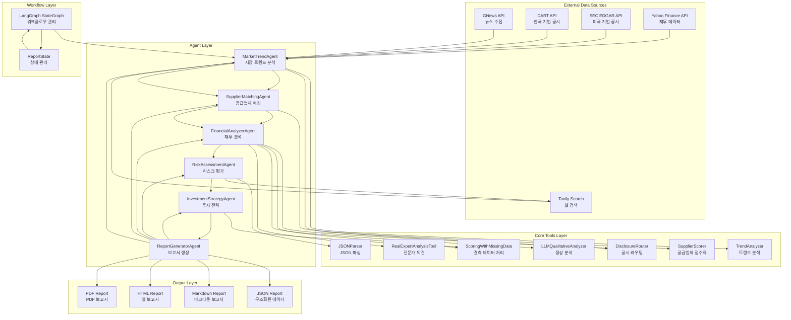

# EV Investment Analysis System - Updated Architecture

## System Overview
This document describes the updated architecture of the EV Investment Analysis System based on the current implementation.

## Architecture Diagram



## Key Components

### 1. External Data Sources
- **GNews API**: 뉴스 기사 수집
- **DART API**: 한국 기업 공시 데이터
- **SEC EDGAR API**: 미국 기업 공시 데이터
- **Yahoo Finance API**: 재무 데이터
- **Tavily Search**: 웹 검색 및 리스크 분석

### 2. Core Tools Layer
- **TrendAnalyzer**: 키워드 추출, 불용어 제거, 트렌드 분석
- **SupplierScorer**: 공급업체 관계 점수화 및 신뢰도 계산
- **DisclosureRouter**: 국가별 공시 API 라우팅 (DART/SEC/Yahoo)
- **ScoringWithMissingData**: 결측 데이터 처리 및 중립값 대체
- **LLMQualitativeAnalyzer**: 뉴스/공시 기반 정성 분석
- **JSONParser**: LLM 출력 JSON 파싱 및 검증
- **RealExpertAnalysisTool**: 전문가 의견 분석

### 3. Agent Layer
- **MarketTrendAgent**: 뉴스 수집, 공시 데이터 수집, 트렌드 분석
- **SupplierMatchingAgent**: 공급업체 식별 및 OEM/Supplier 분류
- **FinancialAnalyzerAgent**: 재무 분석, 정성 분석, 투자 점수 계산
- **RiskAssessmentAgent**: 리스크 평가, 상대적 리스크 분류
- **InvestmentStrategyAgent**: 투자 기회 식별, 포트폴리오 구성
- **ReportGeneratorAgent**: 최종 보고서 생성

### 4. Workflow Layer
- **LangGraph StateGraph**: 에이전트 간 순차 실행 관리
- **ReportState**: 전체 상태 관리 및 데이터 전달

## Data Flow

### 1. Market Trend Analysis
```
GNews/DART/SEC/Yahoo → MarketTrendAgent → TrendAnalyzer → 트렌드 분석 결과
```

### 2. Supplier Matching
```
MarketTrendAgent → SupplierMatchingAgent → SupplierScorer → 공급업체 관계
```

### 3. Financial Analysis
```
SupplierAgent → FinancialAnalyzerAgent → DisclosureRouter + LLMQualitative → 재무 분석
```

### 4. Risk Assessment
```
FinancialAgent → RiskAssessmentAgent → JSONParser + Tavily → 리스크 평가
```

### 5. Investment Strategy
```
RiskAgent → InvestmentStrategyAgent → ScoringTool → 투자 전략
```

### 6. Report Generation
```
모든 Agent → ReportGeneratorAgent → JSON/Markdown/HTML/PDF
```

## Key Improvements

### 1. 공시 데이터 처리 개선
- `DisclosureRouter`로 국가별 API 라우팅
- `state['disclosure_data']`로 공시 데이터 상태 관리
- CIK 10자리 패딩 및 SEC API 오류 수정

### 2. 트렌드 분석 강화
- `TrendAnalyzer`로 불용어 제거 및 언어 감지
- Fallback 규칙으로 최소 트렌드 보장
- Impact Score 계산 및 의미있는 트렌드명 생성

### 3. 공급업체 분석 개선
- `SupplierScorer`로 2단계 신뢰도 점수화
- OEM/Supplier 분류 로직 추가
- 공급업체 관계 가중치 계산

### 4. 리스크 평가 강화
- `JSONParser`로 LLM 출력 안정화
- 상대적 리스크 분류로 균형잡힌 분포
- Tavily 검색 기반 실시간 리스크 분석

### 5. 정성 분석 개선
- `LLMQualitativeAnalyzer`로 실제 데이터 기반 분석
- `RealExpertAnalysisTool`로 전문가 의견 통합
- 뉴스/공시 데이터 활용한 신뢰성 있는 평가

### 6. 결측 데이터 처리
- `ScoringWithMissingData`로 섹터 중간값 대체
- Z-score 정규화 가드 추가
- 투자 기회 생성 조건 완화

## State Management

### ReportState Structure
```python
{
    'news_articles': List[Dict],           # 뉴스 기사
    'disclosure_data': List[Dict],         # 공시 데이터 (새로 추가)
    'suppliers': List[Dict],               # 공급업체 정보
    'financial_analysis': Dict,            # 재무 분석 결과
    'risk_assessment': Dict,               # 리스크 평가 결과
    'investment_strategy': Dict,           # 투자 전략
    'final_report': Dict,                  # 최종 보고서
    'source_manager': SourceManager,       # 출처 관리
    'messages': List[str],                 # 로그 메시지
    'errors': List[Dict]                   # 오류 정보
}
```

## Error Handling

### 1. API 실패 처리
- 각 에이전트에서 try-catch로 오류 처리
- 실패 시 빈 데이터로 설정하여 파이프라인 중단 방지
- 오류 정보를 state에 저장하여 디버깅 지원

### 2. JSON 파싱 오류
- `JSONParser`로 LLM 출력 안정화
- 마크다운 제거, 후행 콤마 수정, NaN 처리
- 실패 시 fallback 데이터 제공

### 3. 데이터 검증
- 각 단계에서 데이터 유효성 검사
- 결측 데이터 자동 대체
- 신뢰도 점수 기반 필터링

## Performance Optimizations

### 1. 캐싱
- Tavily 검색 결과 캐싱
- API 호출 결과 캐싱
- 중복 요청 방지

### 2. 병렬 처리
- 각 에이전트 내부에서 병렬 처리
- API 호출 최적화
- 비동기 처리 고려

### 3. 리소스 관리
- 메모리 사용량 최적화
- API 호출 제한 준수
- 타임아웃 설정

## Future Enhancements

### 1. 실시간 데이터
- WebSocket 기반 실시간 업데이트
- 스트리밍 데이터 처리
- 실시간 알림 시스템

### 2. 고급 분석
- 머신러닝 모델 통합
- 예측 분석 기능
- 시나리오 분석

### 3. 사용자 인터페이스
- 웹 대시보드
- 인터랙티브 차트
- 사용자 맞춤 설정

### 4. 확장성
- 마이크로서비스 아키텍처
- 컨테이너화
- 클라우드 배포
