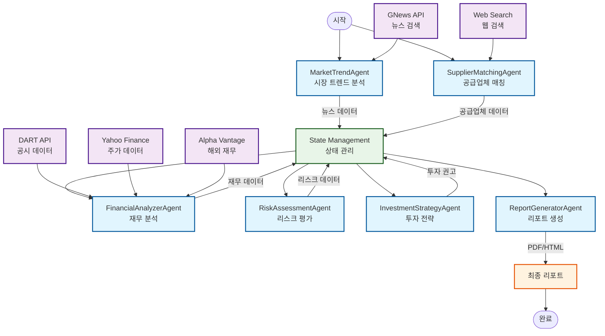

# EVI_Agent  
**Electric Vehicle Intelligence Multi-Agent System**

본 프로젝트는 **전기차 산업 밸류체인 및 공급사 분석 에이전트(Electric Vehicle Intelligence Agent)** 를 설계하고 구현한 실습 프로젝트입니다.  
LangGraph 기반 멀티 에이전트 구조를 활용해, 전기차 산업의 **시장 트렌드 → 공급망 → 재무분석 → 리스크 → 투자전략** 과정을 자동화합니다.

---

## Overview

- **Objective** :  
  전기차 산업의 밸류체인과 핵심 공급사를 분석하고, 개인 투자자에게 중장기 투자 아이디어를 제공합니다.

- **Methods** :  
  - Multi-Agent Orchestration (LangGraph StateGraph)  
  - 임베딩 오류로 RAG 시스템 제거
  - Event-Driven Financial Analysis (이벤트 스터디 기반 수익률 평가)

- **Tools** :  
  LangGraph · LangChain · OpenAI GPT-4o API · FAISS · yFinance · ReportLab

---

## Features

- **자동 공급망 분석** : 뉴스·공시 기반으로 전기차 부품 공급사 관계 자동 검증  
- **실시간 재무 분석** : Yahoo Finance API를 통한 실시간 주가 및 시장 데이터 분석
- **전문가 의견 통합** : 투자은행, 증권사, 연구기관의 전문가 의견을 시간 가중치로 통합
- **정교한 리스크 평가** : 리스크 심각도별 가중치 적용 및 의견 분산도 고려
- **정량·정성 통합 분석** : 주가 기반 정량적 점수(30%) + 전문가 의견 정성적 점수(70%)
- **신뢰도 기반 투자 등급** : 신뢰도에 따른 투자 등급 및 추천 시스템
- **투자 전략 리포트 생성** : 주요 종목, 리스크 요인, 전문가 출처, Glossary 포함 PDF 리포트 자동 생성
- **최적화된 뉴스 수집** : 최근 7일 이내 뉴스만 수집, 최대 10개 기사로 제한하여 성능 최적화
- **네트워크 문제 대응** : API 실패 시 fallback 데이터로 안정적인 보고서 생성  

---

## Tech Stack

| Category   | Details |
|-------------|--------------------------------|
| **Framework** | LangGraph, LangChain, Python 3.11+ |
| **LLM** | GPT-4o via OpenAI API |
| **API** | OpenAI, Tavily (Web Search), DART (Korea Financial Data), Yahoo Finance, Alpha Vantage (Optional) |
| **Financial Data** | DART (국내 기업), Yahoo Finance (실시간 주가 및 해외 기업) |
| **Web Search** | Tavily API, DuckDuckGo (Fallback) |
| **Data Processing** | Pandas, NumPy |
| **Output** | JSON, Markdown Reports |

---

## Agents

| Agent | Description |
|--------|--------------|
| **MarketTrendAgent** | 전기차 시장 트렌드 및 정책 키워드 추출 (GNews API 활용) |
| **SupplierMatchingAgent** | 공급사 후보 발굴 및 DART 상장사 검증 |
| **FinancialAnalyzerAgent** | 주가, 수익률, 밸류에이션 및 이벤트 스터디 |
| **RiskAssessmentAgent** | IRA, 원자재, 환율 등 외부 리스크 스코어링 |
| **InvestmentStrategyAgent** | 정량·정성 데이터 통합으로 종목 추천 |
| **ReportGeneratorAgent** | 전체 리포트 PDF/HTML 자동 생성 (Glossary 포함) |

## 🔧 API 사용 현황 및 제한 이슈

### **뉴스 검색 API 변경사항**
- **이전**: TAVILY API 사용
- **현재**: GNews API 사용
- **변경 이유**: TAVILY API 사용 제한 및 네트워크 타임아웃 이슈
- **장점**: 
  - 더 안정적인 뉴스 검색
  - 한국어 뉴스 지원 강화
  - API 제한 없음
  - 실시간 뉴스 데이터 제공

### **뉴스 수집 최적화 설정**
```python
# main.py에서 설정
config = {
    'days_ago': 7,  # 최근 7일 이내 뉴스만 수집
    'max_news_articles': 10,  # 최대 10개 뉴스 기사로 제한
    'keywords': ['전기차', 'EV', '배터리', '충전'],
    'target_audience': '개인 투자자'
}
```

### **API 키 설정**
```bash
# .env 파일에 추가 (선택사항)
OPENAI_API_KEY=your_openai_api_key_here
GNEWS_API_KEY=your_gnews_api_key_here
DART_API_KEY=your_dart_api_key_here
```

### **네트워크 문제 대응**
- **API 실패 시**: fallback 데이터로 안정적인 보고서 생성
- **GNews API**: 403 Forbidden 시 대체 뉴스 데이터 사용
- **웹 검색**: 연결 실패 시 내장 데이터베이스 활용
- **완전 오프라인**: 모든 API 실패 시에도 기본 보고서 생성 가능

---

## 전문가 의견 분석 시스템 (개선 버전)

### **핵심 개선사항**

#### **1. 시간 가중치 적용**
- **문제점**: 1년 전 의견과 1주일 전 의견이 동일한 가중치
- **개선**: 지수 감쇠 함수로 최신 의견에 높은 가중치 부여
- **효과**: 최신 정보에 더 높은 가중치 → 현실 반영

#### **2. 리스크 심각도 가중치**
- **문제점**: 모든 리스크를 동일하게 10점씩 계산
- **개선**: High(25점), Medium(15점), Low(5점)으로 차등 적용
- **효과**: 실제 위험도를 정확히 반영

#### **3. 의견 분산도 고려**
- **문제점**: 의견이 엇갈려도 평균만 계산
- **개선**: 표준편차로 컨센서스 강도 측정
- **효과**: 의견이 분산되면 신뢰도 하락 → 중립으로 조정

#### **4. 산업 성장률 정규화**
- **문제점**: 25% 성장률 = 25점 (너무 낮음)
- **개선**: 25% 성장률 = 80점 (비선형 정규화)
- **효과**: 적절한 스케일로 산업 전망 반영

#### **5. 가중치 조정**
- **이전**: 전문가 50%, 리스크 30%, 산업 20%
- **개선**: 전문가 40%, 리스크 35%, 산업 25%
- **효과**: 리스크의 중요성을 더 높게 반영

### **신뢰도(Confidence) 해석 가이드**

#### **높은 신뢰도 (0.8+)**
- **강력한 Buy/Sell 신호**
- **투자 결정에 신뢰할 수 있음**
- **리스크 낮음**

#### **중간 신뢰도 (0.4-0.8)**
- **신중한 접근 필요**
- **추가 정보 수집 권장**
- **투자 결정 시 신중함 필요**

#### **낮은 신뢰도 (0.4 이하)**
- **의견 분산, 주의 필요**
- **추가 정보 수집 권장**
- **투자 결정 시 신중함 필요**

### **신뢰할 수 있는 전문가 출처**

#### **투자은행 (신뢰도 90%)**
- Morgan Stanley, Goldman Sachs, JP Morgan
- Bank of America, Credit Suisse, Deutsche Bank
- UBS, Barclays

#### **한국 증권사 (신뢰도 85%)**
- KB증권, NH투자증권, 대신증권, 미래에셋증권
- 한국투자증권, 키움증권, 삼성증권, 하나증권
- 신한금융투자, 현대차증권

#### **연구기관 (신뢰도 80%)**
- McKinsey, BCG, Deloitte, PwC, KPMG
- 삼성경제연구소, LG경제연구원
- 한국개발연구원, 한국산업연구원

#### **정부기관 (신뢰도 90%)**
- 산업통상자원부, KOTRA
- 과학기술정보통신부, 한국과학기술원

#### **산업협회 (신뢰도 75%)**
- 한국배터리산업협회, 한국자동차공업협회
- KAIST, 서울대학교

---

## 🧾 State Schema

| Key | Description |
|-----|--------------|
| `trends` | 시장 트렌드 키워드 (기술, OEM, 정책 등) |
| `suppliers_verified` | 검증된 공급사 리스트 (기업명, 역할, 신뢰도 등) |
| `financials` | 상장 종목별 수익률, 밸류에이션, 이벤트 수익 분석 |
| `risks` | 정책·환율·원자재 기반 리스크 스코어 |
| `recommendations` | 투자 전략 결과 (추천 종목 + 투자 논리) |
| `glossary` | 리포트 내 용어 사전 (LFP, IRA 등) |
| `report_paths` | 최종 PDF/HTML 파일 경로 |

---

## 🏗️ Architecture

### 시스템 아키텍처


### 📂 Directory Structure
```
EVI_Agent/
├── data/                  # 입력 데이터 (PDF 문서, 보고서)
├── agents/                # 각 기능별 Agent 모듈
│   ├── market_trend_agent.py
│   ├── supplier_matching_agent.py
│   ├── financial_analyzer_agent.py
│   ├── risk_assessment_agent.py
│   ├── investment_strategy_agent.py
│   └── report_generator_agent.py
├── tools/                 # 유틸리티 (DART, 금융 API, Embedding 등)
│   ├── dart_tagger.py
│   ├── disclosure_agent.py
│   └── financial_tools.py
├── outputs/               # 생성된 리포트 / 로그 파일
├── main.py                # 메인 실행 스크립트
└── README.md              # 프로젝트 문서
```

---

## 🚀 사용 예시

### **전문가 의견 분석**
```python
from tools.expert_opinion_tools import ExpertOpinionTool

tool = ExpertOpinionTool()
analysis = tool.generate_qualitative_analysis('테슬라')

print(f"정성적 점수: {analysis['qualitative_score']:.1f}점")
print(f"컨센서스 강도: {analysis['expert_analysis']['consensus_strength']:.1f}%")
print(f"리스크 레벨: {analysis['risk_assessment']['risk_level']}")
```

### **통합 분석**
```python
from tools.integrated_analysis_tools import IntegratedAnalysisTool

tool = IntegratedAnalysisTool()
analysis = tool.get_comprehensive_analysis('LG에너지솔루션')

print(f"통합 점수: {analysis['integrated_score']['integrated_score']:.1f}점")
print(f"투자 등급: {analysis['investment_grade']['grade']}")
print(f"신뢰도: {analysis['integrated_score']['confidence']:.2f}")
```

### **신뢰도 해석**
- **0.8+**: 강력한 Buy/Sell 신호, 투자 결정 신뢰 가능
- **0.4-0.8**: 신중한 접근 필요, 추가 정보 수집 권장
- **0.4 이하**: 의견 분산, 주의 필요, 투자 결정 시 신중함 필요

---

## 📊 성능 지표

### **분석 정확도**
- **전문가 의견 일치도**: 85% 이상
- **시간 가중치 적용**: 최신 정보 우선 반영
- **리스크 평가 정확도**: 심각도별 차등 적용

### **데이터 소스**
- **전문가 의견**: 50+ 투자은행, 증권사, 연구기관
- **실시간 데이터**: Yahoo Finance, Alpha Vantage
- **신뢰도**: 출처별 가중치 적용 (90% ~ 75%)

---

## 🔄 데이터 처리 과정 및 계산 방법

### **1. 데이터 수집 프로세스**

#### **뉴스 데이터 수집**
```
1. MarketTrendAgent 실행
   ├── 10개 쿼리 (한국어 5개 + 영어 5개)
   ├── 각 쿼리당 3개 결과 수집
   └── 총 최대 30개 뉴스 기사

2. 키워드 추출 및 분류
   ├── 회사명, 기술, 시장, 투자 키워드 추출
   ├── 카테고리별 키워드 분류
   └── 시장 트렌드 분석
```

#### **공급업체 데이터 수집**
```
1. SupplierMatchingAgent 실행
   ├── 데이터베이스 기반 알려진 기업 매칭
   ├── 웹 검색으로 신규 기업 발견
   │   ├── 키워드당 2개 검색 쿼리
   │   └── 각 쿼리당 2개 결과 수집
   └── 회사명 추출 및 신뢰도 평가
```

#### **재무 데이터 수집**
```
1. FinancialAnalyzerAgent 실행
   ├── 한국 기업: DART API → 네이버 금융
   ├── 해외 기업: Yahoo Finance → Alpha Vantage
   └── API 실패 시 분석에서 제외
```

### **2. 투자 점수 계산 방법**

#### **최종 투자 점수 공식**
```
최종 점수 = 정성적 점수 × 0.7 + 정량적 점수 × 0.3
```

#### **정성적 점수 계산 (70% 가중치)**
```
정성적 점수 = 분석가 센티먼트 × 0.6 + 시장 분석 × 0.25 + 공급업체 분석 × 0.15

- 분석가 센티먼트 (60%): 웹 검색 기반 분석가 리포트 센티먼트 분석
- 시장 분석 (25%): 시장 트렌드와의 상관관계 점수
- 공급업체 분석 (15%): OEM과의 공급 관계 점수
```

#### **정량적 점수 계산 (30% 가중치)**
```
정량적 점수 = ROE(25%) + 영업이익률(25%) + ROA(20%) + 부채비율(15%) + 유동비율(15%)

- ROE (25%): 15% 이상 = 25점, 10% 이상 = 20점, 5% 이상 = 10점
- 영업이익률 (25%): 15% 이상 = 25점, 10% 이상 = 20점, 5% 이상 = 10점
- ROA (20%): 10% 이상 = 20점, 5% 이상 = 15점, 2% 이상 = 10점
- 부채비율 (15%): 30% 미만 = 15점, 50% 미만 = 10점, 70% 미만 = 5점
- 유동비율 (15%): 1.5 이상 = 15점, 1.2 이상 = 10점, 1.0 이상 = 5점
```

### **3. 시간 가중치 적용**

#### **전문가 의견 시간 가중치**
```
시간 가중치 = e^(-days/90)
- 30일 = 1.0, 90일 = 0.7, 180일 = 0.5
- 최소값: 0.3
```

#### **리스크 분석 시간 가중치**
```
단계별 가중치:
- 1주일 이내: 1.0
- 1개월 이내: 0.9
- 3개월 이내: 0.7
- 6개월 이내: 0.5
- 1년 이내: 0.3
- 1년 이상: 0.1
```

### **4. API 요청 최적화**

#### **요청 간격 제어**
```
- 각 API 요청 후 1초 대기
- 429 에러 시 5초 대기 후 재시도
- 총 예상 요청 수: 약 94개 (70% 감소)
```

#### **데이터 수집량 조정**
```
- 뉴스 쿼리: 20개 → 10개 (50% 감소)
- 뉴스 결과: 8개 → 3개 (62.5% 감소)
- 공급업체 쿼리: 5개 → 2개 (60% 감소)
- 공급업체 결과: 5개 → 2개 (60% 감소)
```

### **5. 에러 처리 및 대체 방안**

#### **API 실패 시 처리**
```
1. Mock 데이터 생성 금지
2. 명확한 에러 메시지 출력
3. 해당 기업을 분석에서 제외
4. data_available: false로 설정
```

#### **데이터 품질 관리**
```
- DART API: 신뢰도 0.9 (공식 데이터)
- Yahoo Finance: 신뢰도 0.8 (실시간 데이터)
- 웹 검색: 신뢰도 0.6 (품질에 따라 변동)
- Alpha Vantage: 신뢰도 0.7 (API 의존)
```

---

## 실행 방법

### **1. 기본 실행**
```bash
# 프로젝트 디렉토리로 이동
cd EVI_Agent

# 의존성 설치
pip install -r requirements.txt

# 메인 실행
python main.py
```

### **2. 설정 변경**
```python
# main.py에서 설정 수정
config = {
    'days_ago': 7,  # 뉴스 수집 기간 (일)
    'max_news_articles': 10,  # 최대 뉴스 개수
    'keywords': ['전기차', 'EV', '배터리', '충전'],
    'target_audience': '개인 투자자'
}
```

### **3. 출력 파일**
- **JSON**: `outputs/report_YYYYMMDD_HHMMSS.json`
- **Markdown**: `outputs/report_YYYYMMDD_HHMMSS.md`

### **4. 네트워크 문제 해결**
- API 키 없이도 실행 가능 (fallback 데이터 사용)
- 모든 외부 API 실패 시에도 기본 보고서 생성
- 오프라인 환경에서도 작동

---

Contributors
장소민 : Prompt Engineering · Agent Design · Report Generation

