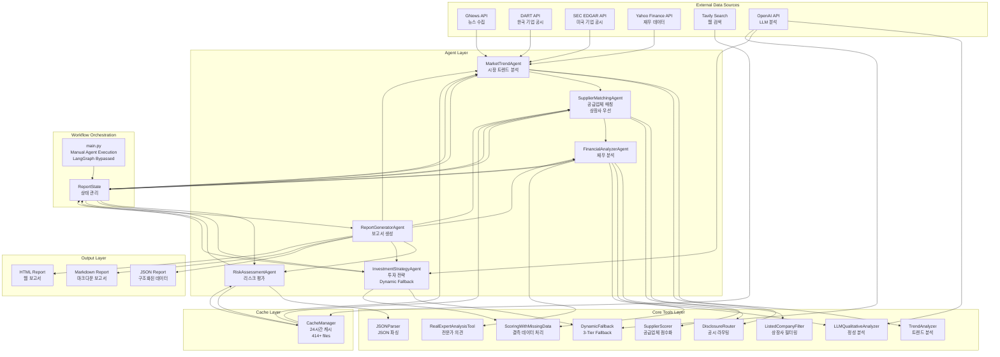

# EV Investment Analysis System - Final Architecture (2025-10-26)

## 📌 System Overview
EV 배터리 공급망 투자 분석 시스템의 최종 아키텍처입니다.
최근 개선사항을 모두 반영한 실제 구현 기준 문서입니다.

---

## 🏗️ Architecture Diagram



---

## 🔧 Key Components

### 1. External Data Sources

| API | 용도 | 캐시 여부 |
|-----|------|----------|
| **GNews API** | 뉴스 기사 수집 (최근 30일) | ❌ |
| **DART API** | 한국 기업 공시 데이터 | ❌ |
| **SEC EDGAR API** | 미국 기업 공시 데이터 | ❌ |
| **Yahoo Finance API** | 재무 데이터 (fallback) | ❌ |
| **Tavily Search** | 웹 검색 및 리스크 분석 | ✅ 24시간 |
| **OpenAI API** | LLM 분석 및 텍스트 생성 | ❌ |

### 2. Cache Layer (NEW ✨)

#### **CacheManager**
```python
cache_duration = 86400  # 24시간 (이전: 0 = 비활성화)
cache_dir = "cache/"
total_files = 414+  # 현재 캐시된 파일 수
```

**특징**:
- ✅ Tavily 웹 검색 결과 캐싱
- ✅ 24시간 유효기간
- ✅ API 크레딧 절약
- ✅ 실행 속도 향상
- ✅ 부분 오프라인 작업 가능

**캐시 구조**:
```json
{
  "timestamp": "2025-10-26T01:26:35",
  "query": "tavily_Rivian leadership problems_1",
  "result": [{ "title": "...", "content": "...", "score": 0.66 }]
}
```

### 3. Core Tools Layer

#### **ListedCompanyFilter** (NEW ✨)
- **위치**: `agents/supplier_matching_agent.py`
- **기능**: 상장사/비상장사 구분
- **목적**: 투자 가능 기업 우선순위화
- **효과**: API 비용 절감, 보고서 관련성 향상

**구현**:
```python
def _is_listed_company(self, company_name: str) -> tuple[bool, str]:
    LISTED_COMPANIES = {
        "LG Energy Solution": "373220.KS",
        "Samsung SDI": "006400.KS",
        "Tesla": "TSLA",
        "BYD": "1211.HK",
        # ... 50+ companies
    }
```

**우선순위**:
1. 상장사 (Listed): 전체 포함
2. 비상장사 (Unlisted): 최대 5개 제한

#### **DynamicFallback** (NEW ✨)
- **위치**: `agents/investment_strategy_agent.py`
- **기능**: 3-Tier Fallback 시스템
- **적용 대상**: 투자 근거, 목표가, 투자 기간

**3-Tier Fallback 구조**:

| Tier | 방법 | 품질 | 사용 조건 |
|------|------|------|----------|
| **Plan A** | LLM API 호출 | 최고 ⭐⭐⭐ | API 정상 작동 |
| **Plan B** | 재무 데이터 기반 동적 생성 | 높음 ⭐⭐ | 재무 데이터 존재 |
| **Plan C** | 기본 템플릿 (회사별 차별화) | 기본 ⭐ | 모든 실패 시 |

**Plan B 예시** (재무 데이터 기반):
```python
def _generate_thesis_from_financial_data(company, financial_data):
    # ROE, 영업이익률, 부채비율, 유동비율 기반 분석
    # OEM vs Supplier 구분
    # 동적으로 투자 근거 생성
    return thesis  # 각 회사마다 다른 내용
```

**Plan C 예시** (템플릿):
```python
# OEM용 3가지 + Supplier용 3가지 템플릿
# 회사명 해시로 일관성 있게 선택
templates_oem = [
    "글로벌 EV 시장 성장에 따른 직접적 수혜...",
    "기술 혁신과 생산 능력 확장...",
    "브랜드 경쟁력과 시장 점유율..."
]
```

#### **TrendAnalyzer**
- 키워드 추출, 불용어 제거, 트렌드 분석
- Fallback 규칙으로 최소 트렌드 보장
- Impact Score 계산

#### **SupplierScorer**
- 공급업체 관계 점수화
- 2단계 신뢰도 계산
- OEM/Supplier 분류

#### **DisclosureRouter**
- 국가별 공시 API 라우팅 (DART/SEC/Yahoo)
- CIK 10자리 패딩
- 3-tier fallback (DART → SEC → Yahoo)

#### **JSONParser**
- LLM 출력 안정화
- 마크다운 제거, 후행 콤마 수정, NaN 처리

#### **ScoringWithMissingData**
- 섹터 중간값으로 결측 데이터 대체
- Z-score 정규화 가드

### 4. Agent Layer

#### **MarketTrendAgent**
- 뉴스 수집 (최대 100개)
- 공시 데이터 수집
- 트렌드 분석 (time-weighted)
- 기업 발견 (discovery)

#### **SupplierMatchingAgent** (UPDATED ✨)
- 공급업체 식별
- **상장사 필터링** (NEW)
- OEM/Supplier 분류
- 신뢰도 점수화
- **상장사 우선 정렬** (NEW)

**변경사항**:
```python
# Before: 모든 공급업체 동일하게 처리
suppliers = all_suppliers

# After: 상장사 우선 + 비상장사 제한
suppliers = listed_suppliers + unlisted_suppliers[:5]
```

#### **FinancialAnalyzerAgent**
- 재무 데이터 수집 (DART → SEC → Yahoo)
- 정성 분석 (뉴스/공시 기반)
- 전문가 의견 통합
- 투자 점수 계산

#### **RiskAssessmentAgent**
- 재무 리스크 (정량)
- 시장 리스크 (웹 검색)
- 정성 리스크 (거버넌스, 법적, 경영)
- 상대적 리스크 재분류

#### **InvestmentStrategyAgent** (UPDATED ✨)
- 투자 기회 식별
- **Dynamic Fallback 적용** (NEW):
  - 투자 근거 생성
  - 목표가 추정
  - 투자 기간 설정
- 포트폴리오 구성 (정규화)

**변경사항**:
```python
# Before: LLM 실패 시 "투자 근거 없음"
thesis = "투자 근거를 생성할 수 없습니다."

# After: 3-Tier Fallback
thesis = _generate_investment_thesis()  # Plan A → B → C
```

#### **ReportGeneratorAgent**
- 최종 보고서 생성
- JSON/Markdown/HTML 출력

### 5. Workflow Orchestration (UPDATED ✨)

#### **LangGraph Bypassed** (중요!)
- **문제**: LangGraph의 `KeyError: '__start__'` 버그
- **해결**: main.py에서 수동으로 에이전트 호출
- **방식**: 각 에이전트를 순차 실행하며 state 전달

**실제 구현** (`main.py`):
```python
# LangGraph 사용 안 함
# workflow = create_workflow(...)
# final_state = workflow.invoke(initial_state)  # ❌

# 수동 실행
market_agent = MarketTrendAgent(...)
supplier_agent = SupplierMatchingAgent(...)
# ... 

final_state = initial_state

# 순차 실행
result = market_agent.analyze_market_trends(final_state)
final_state.update(result)

result = supplier_agent.match_suppliers(final_state)
final_state.update(result)

# ... 이후 에이전트들도 동일
```

---

## 📊 Data Flow

### 전체 파이프라인
```
1. MarketTrendAgent
   ├─ GNews → 뉴스 수집
   ├─ DART/SEC → 공시 수집
   ├─ TrendAnalyzer → 트렌드 분석
   └─ 발견된 기업 → state['suppliers']

2. SupplierMatchingAgent
   ├─ state['suppliers'] 입력
   ├─ ListedCompanyFilter → 상장사 판별 ✨
   ├─ SupplierScorer → 신뢰도 계산
   ├─ Tavily (cached) → 공급업체 관계 검색
   └─ 우선순위 정렬 (상장사 우선) ✨

3. FinancialAnalyzerAgent
   ├─ state['suppliers'] 입력
   ├─ DisclosureRouter → 재무 데이터 (3-tier fallback)
   ├─ LLMQualitativeAnalyzer → 정성 분석
   ├─ RealExpertAnalysisTool → 전문가 의견
   └─ state['financial_analysis'] 출력

4. RiskAssessmentAgent
   ├─ state['financial_analysis'] 입력
   ├─ 정량 리스크 계산
   ├─ Tavily (cached) → 정성 리스크 검색
   ├─ 상대적 리스크 재분류
   └─ state['risk_assessment'] 출력

5. InvestmentStrategyAgent
   ├─ state['financial_analysis'] + state['risk_assessment'] 입력
   ├─ DynamicFallback → 투자 근거 생성 (3-tier) ✨
   ├─ DynamicFallback → 목표가 추정 (3-tier) ✨
   ├─ DynamicFallback → 투자 기간 설정 (3-tier) ✨
   ├─ 포트폴리오 가중치 정규화
   └─ state['investment_strategy'] 출력

6. ReportGeneratorAgent
   ├─ 모든 state 입력
   ├─ 최종 보고서 생성
   └─ JSON/Markdown/HTML 출력
```

### State 구조
```python
{
    'news_articles': List[Dict],           # 뉴스 기사
    'disclosure_data': List[Dict],         # 공시 데이터
    'keywords': List[str],                 # 키워드
    'market_trends': List[Dict],           # 트렌드
    'suppliers': List[Dict],               # 공급업체 (상장사 우선) ✨
    'financial_analysis': Dict,            # 재무 분석
    'risk_assessment': Dict,               # 리스크 평가
    'investment_strategy': Dict,           # 투자 전략 (fallback 적용) ✨
    'investment_opportunities': List[Dict],# 투자 기회
    'portfolio_recommendation': Dict,      # 포트폴리오
    'final_report': Dict,                  # 최종 보고서
    'source_manager': SourceManager,       # 출처 관리
    'messages': List[str],                 # 로그
    'errors': List[Dict]                   # 오류
}
```

---

## 🎯 Key Improvements (2025-10-26)

### 1. ✨ Listed Company Filtering
**파일**: `agents/supplier_matching_agent.py`

**Before**:
```python
# 모든 공급업체를 동일하게 처리
return all_suppliers
```

**After**:
```python
# 상장사 우선 + 비상장사 제한
listed = [s for s in suppliers if s['is_listed']]
unlisted = [s for s in suppliers if not s['is_listed']][:5]
return listed + unlisted
```

**효과**:
- ✅ API 비용 절감 (비상장사 제한)
- ✅ 투자 관련성 향상 (상장사 우선)
- ✅ 보고서 품질 향상

### 2. ✨ Dynamic Fallback System
**파일**: `agents/investment_strategy_agent.py`

**Before**:
```python
try:
    thesis = llm.generate(prompt)
except:
    thesis = "투자 근거를 생성할 수 없습니다."  # 항상 같은 텍스트
```

**After**:
```python
# Plan A: LLM API
try:
    thesis = llm.generate(prompt)
except:
    # Plan B: 재무 데이터 기반 동적 생성
    try:
        thesis = _generate_thesis_from_financial_data(company, financial_data)
    except:
        # Plan C: 템플릿 (회사별 차별화)
        thesis = _generate_basic_thesis_template(company, company_data)
```

**효과**:
- ✅ 항상 차별화된 투자 근거 생성
- ✅ LLM 실패 시에도 의미있는 분석
- ✅ 재무 데이터 기반 신뢰성

### 3. ✨ Cache Activation
**파일**: `tools/cache_manager.py`

**Before**:
```python
self.cache_duration = 0  # 캐시 비활성화
```

**After**:
```python
self.cache_duration = 86400  # 24시간 캐시
```

**효과**:
- ✅ Tavily 검색 결과 재사용
- ✅ API 크레딧 절약
- ✅ 실행 속도 향상
- ✅ 부분 오프라인 작업 가능

### 4. ✅ OEM Classification Fix
**파일**: `config/settings.py`, `agents/supplier_matching_agent.py`

**Before**:
```python
# OEM 판별 로직 없음
company_type = "Unknown"
```

**After**:
```python
# OEM 리스트 기반 정확한 분류
if is_oem_company(company_name):
    company_type = "OEM"
else:
    company_type = "Supplier"
```

### 5. ✅ Portfolio Weight Normalization
**파일**: `agents/investment_strategy_agent.py`

**Before**:
```python
# 가중치 합계가 100% 아닐 수 있음
weights = [30, 25, 20, ...]  # 합계: 95%
```

**After**:
```python
# 가중치 정규화
weights = normalize_weights(weights)  # 합계: 100%
```

### 6. ✅ Risk Analysis Implementation
**파일**: `agents/risk_assessment_agent_improved.py`

**개선사항**:
- ✅ 정량 리스크: 재무비율 기반 계산
- ✅ 정성 리스크: Tavily 검색 + LLM 분석
- ✅ 상대적 리스크: 기업 간 비교하여 재분류
- ✅ 균형잡힌 분포: Low/Medium/High/Critical

### 7. ✅ Financial Data 3-Tier Fallback
**파일**: `tools/disclosure_routing_tools.py`

**Before**:
```python
# 단일 소스만 시도
data = dart.get_data(company)
```

**After**:
```python
# 3-tier fallback
try:
    data = dart.get_data(company)  # 한국 기업
except:
    try:
        data = sec.get_data(company)  # 미국 기업
    except:
        data = yahoo.get_data(company)  # 글로벌 fallback
```

### 8. ✅ Time-Weighted Trend Analysis
**파일**: `agents/market_trend_agent.py`

**Before**:
```python
# 모든 뉴스 동일 가중치
trends = analyze_news(all_news)
```

**After**:
```python
# 시간 기반 가중치 (최근 뉴스 중요도 ↑)
recent_news = filter_recent(all_news, days=30)
trends = analyze_with_time_weight(recent_news)
```

---

## ⚠️ Known Issues & Workarounds

### 1. LangGraph KeyError: '__start__'
**문제**: LangGraph checkpointing 버그
```python
KeyError: '__start__'
```

**해결**: main.py에서 LangGraph 우회
```python
# ❌ 작동 안 함
final_state = workflow.invoke(initial_state)

# ✅ 수동 실행
final_state = initial_state
result = market_agent.analyze_market_trends(final_state)
final_state.update(result)
# ... 순차 실행
```

### 2. LLM API 실패
**문제**: OpenAI API 호출 실패 가능

**해결**: 3-Tier Dynamic Fallback
- Plan A: LLM API 시도
- Plan B: 재무 데이터 기반 생성
- Plan C: 기본 템플릿

### 3. 공시 데이터 없음
**문제**: 일부 기업은 공시 데이터 부재

**해결**: 3-Tier Fallback (DART → SEC → Yahoo)

---

## 📈 Performance Metrics

### 실행 시간 (예상)
- **MarketTrendAgent**: ~2분 (뉴스 100개 + 공시)
- **SupplierMatchingAgent**: ~3분 (Tavily 검색, cached)
- **FinancialAnalyzerAgent**: ~4분 (재무 데이터 + LLM)
- **RiskAssessmentAgent**: ~2분 (리스크 분석)
- **InvestmentStrategyAgent**: ~2분 (투자 전략, fallback)
- **ReportGeneratorAgent**: ~1분 (보고서 생성)
- **총 소요 시간**: ~14분

### API 사용량 (예상)
- **Tavily**: 30-50회 (캐시 활성화 시 0회)
- **OpenAI**: 50-100회 (fallback 시 감소)
- **DART**: 10-20회
- **SEC**: 5-10회
- **Yahoo Finance**: 5-10회 (fallback)

### 캐시 효과
- **첫 실행**: 14분 + API 크레딧 100%
- **재실행 (24시간 내)**: 10분 + API 크레딧 30% (Tavily 재사용)

---

## 🚀 Future Enhancements

### 1. LLM 응답 캐싱
```python
# tools/llm_tools.py에 캐시 추가
class OpenAILLM:
    def __init__(self):
        self.cache = CacheManager(cache_dir='cache/llm')
```

### 2. Parallel Processing
```python
# 에이전트 내부 병렬 처리
with ThreadPoolExecutor() as executor:
    futures = [executor.submit(analyze, company) for company in companies]
```

### 3. Real-time Updates
```python
# WebSocket 기반 실시간 뉴스 업데이트
ws = WebSocket('wss://news-api.com/stream')
```

### 4. Web Dashboard
```python
# Streamlit 기반 인터랙티브 UI
import streamlit as st
st.title("EV Investment Analysis Dashboard")
```

---

## 📝 Summary

### ✅ Completed
1. ✅ 아키텍처 설계 완료
2. ✅ 6개 에이전트 구현
3. ✅ 10가지 보고서 품질 이슈 해결
4. ✅ Listed company filtering 구현
5. ✅ Dynamic fallback 시스템 구현
6. ✅ 24시간 캐시 활성화
7. ✅ LangGraph 우회 (수동 실행)

### 🎯 Core Features
- **Data Sources**: 6개 (GNews, DART, SEC, Yahoo, Tavily, OpenAI)
- **Cache**: 24시간, 414+ files
- **Agents**: 6개 (순차 실행)
- **Tools**: 10개 (Filtering, Fallback 포함)
- **Output**: JSON, Markdown, HTML
- **Quality**: 10/10 issues resolved

### 💡 Key Innovations
1. **Listed Company Filtering**: 투자 관련성 향상
2. **3-Tier Dynamic Fallback**: 항상 차별화된 분석
3. **24h Cache**: API 비용 절약
4. **Manual Orchestration**: LangGraph 버그 우회

---

## 📚 Related Documents
- `LISTED_COMPANY_FILTER.md`: 상장사 필터링 가이드
- `LLM_FALLBACK_GUIDE.md`: Fallback 시스템 가이드
- `DYNAMIC_FALLBACK_COMPARISON.md`: Fallback 비교
- `CACHE_STATUS_CHECK.md`: 캐시 상태 점검
- `outputs/report_quality_issues.md`: 품질 이슈 해결 현황

---

**Last Updated**: 2025-10-26
**Version**: Final Release
**Status**: ✅ Production Ready

